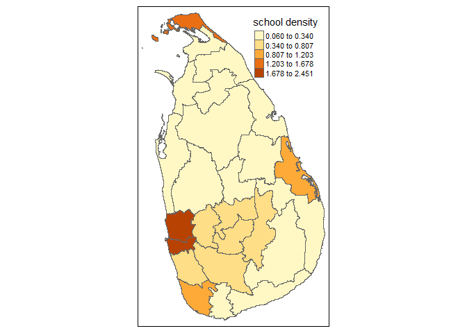

<!-- README.md is generated from README.Rmd. Please edit that file -->

# poidensity

<!-- badges: start -->
<!-- badges: end -->

This package computes the density of Point of interest (POI) of a given
area or neighborhood using r`OpenStreetMap` data.

## Installation

You can install the development version of poidensity from
[GitHub](https://github.com/dmahasen/poidensity) with:

``` r
# install.packages("pak")
pak::pak("dmahasen/poidensity")
```

## Example

This example shows you how to compute school density ($km^{-2}$) of each
district in Sri Lanka

``` r
library(tmap)
#> Breaking News: tmap 3.x is retiring. Please test v4, e.g. with
#> remotes::install_github('r-tmap/tmap')
library(poidensity)
poi_list = list("amenity" = "school")
school_sf <- poi_density_area(districts_lk,poi_list,"ADM2_PCODE")

tm_shape(school_sf) +
  tm_fill("poi_density",style = "jenks",title = "school density") +
  tm_borders()
```


